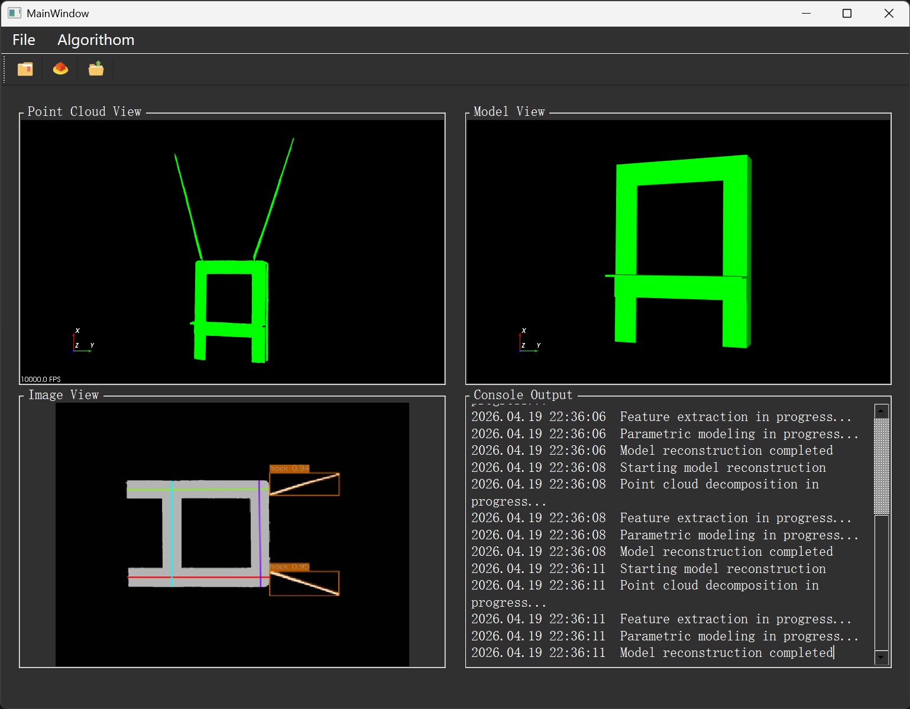

## Citation

If you use this code or find our work helpful in your research, please consider citing:

@ARTICLE{11536779,
  author={Jiang, Shaohua and Wang, Huaming and Zhou, Mengqi and Luo, Qinyao and Li, Ruiqi and Hao, Linbo},
  journal={IEEE Transactions on Instrumentation and Measurement}, 
  title={An Online 3-D Modeling Method Based on Skeleton-Guided Decomposition and Model-Driven Assembly}, 
  year={2026},
  volume={75},
  number={},
  pages={5010414-5010414},
  doi={10.1109/TIM.2026.3697025}
  }

Your citations are greatly appreciated and help support future research.

## Main UI

## Motivation

+The motivation was cant use this project in windows and linux.

+Use new versions of depends:

+MSVC >= 2017

+Qt  >= 5.14.2

+PCL	(1.9.1)

+VTK	(8.2.0)

+OpenCV	(4.4.0)

+OpenCASCADE	(7.7.0)

+CUDA	(11.7)

+TensorRT (8.4.3.1)
